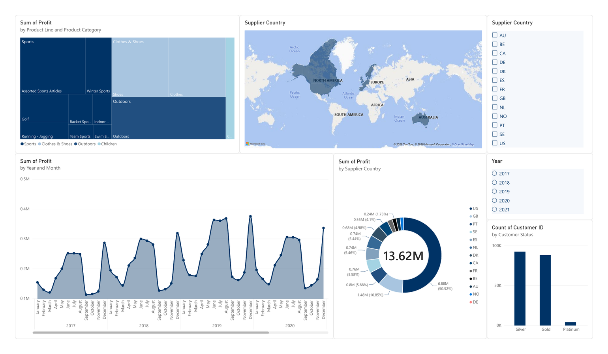

# E-commerce Sales ETL & Analytics

An end-to-end ETL pipeline that combines e-commerce order and product data, cleans and transforms the data using Python/Pandas, loads it into PostgreSQL, and visualizes the results in Power BI.

## Tech Stack

**Python · Pandas · SQLAlchemy · PostgreSQL · Kaggle API · Power BI**

## ETL Process

- Extracted order data from PostgreSQL
- Retrieved product data using the Kaggle API
- Joined and cleaned datasets using Pandas
- Calculated profit, profit margin, and delivery time
- Loaded the transformed dataset back into PostgreSQL

## ETL Notebook

[View the ETL Notebook](ETL.ipynb)

## Power BI Dashboard

